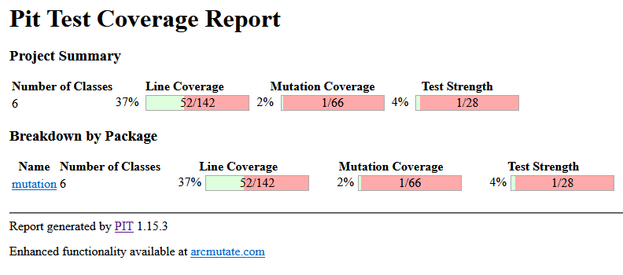
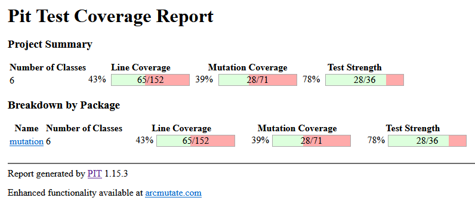

# Técnicas de Documentación y Validación: Proyecto Integrador. TUDAI

Proyecto de aplicación de técnicas de documentación y validación para Java vistas en la cátedra.  
Se trabajaron sobre distintas formas de testeo y documentación de componentes.  
Las herramientas utilizadas fueron: 
 - Para el testeo de unitario: **TestNG, JUnit**.
 - Para la documentación de código: **JavaDoc, Doxygen**.
 - Para la documentación, implementación y testeo de API: **OpenAPI, Swagger, SpringBoot, Postman**.
 - Para el testeo web automático: **Selenium, TestNG**.
 - Para el testeo de mutación: **PITest, TestNG, JUnit**.

## Entorno de desarrollo

El trabajo práctico se desarrolló utilizando Open JDK 17.0.9 en Visual Studio Code.  
Si se requiere, es posible compartir la configuración realizada en el entorno para ejecutar los distintos módulos en una sola instancia del mismo.

## Descripción del proyecto
El proyecto consta de un módulo principal ideado para gestionar las actividades y socios de un club. El mismo fue documentado con JavaDoc y se utilizó para generar un sitio navegable con doxygen.  
También se generaron algunas pruebas unitarias mínimas con TestNG y JUnit.  
Sobre esta base se documentó una API mínima con OpenAPI para luego generar la interfaz con Swagger y añadir la lógica necesaria para completar la implementación. Para testear los endpoints implementados de la API se utilizó Postman.  
Se generó un frontend con HTML y Javascript conectado a dicha API que contempla la funcionalidad de asociar una persona al club e inscribirlo a una actividad. Este frontend se utilizó para ejecutar pruebas automatizadas con Selenium.  
Por último, se ejecutó un test de mutación sobre los test creados inicialmentes para evaluar su calidad. En base a estos resultados se generaron test adicionales para apreciar el impacto en la cobertura.

### Testing 
Para realizar las pruebas unitarias se utilizó [TestNG](https://testng.org/) 7.8.0 y [JUnit 5.10.1](https://junit.org/junit5/).  
Los test para este inciso se encuentran en la ruta `integrador/src/main/test/java/testing/ActividadTest.java` y testea la clase `Actividad.java` en el mismo paquete. 
Se crearon tests para probar las funcionalidades de inscripcion de un socio a una actividad y de asignación de encargado de una actividad. Para algunos de estos tests se generaron @DataProviders y se utilizaron métodos de ejecución previa (@BeforeClass y @BeforeTest) para generar el entorno adecuado.

### Documentación
Se documentó tanto el código como los tests utilizando JavaDoc con sus distintos tags.  
Esta documentación en código fue luego utilizada para generar un sitio navegable con [doxygen](https://www.doxygen.nl/) y doxywizard. Dicho sitio se encuentra en la carpeta `doxygen`.

### API
#### **Open Api - Swagger**
Se generó la documentación de un servicio REST que contemple las funcionalidades dadas con la especificación [OpenAPI](https://www.openapis.org/) 3.0.   
Esta documentación se utilizó para generar el código boilerplate de el servicio en SpringBoot utilizando la función generadora de [Swagger Editor](editor.swagger.io), que además genera un sitio navegable de documentación de la API.  
Se completó la implementación de algunos endpoints requeridos agregando la lógica de negocio correspondiente logrando un servicio REST de prueba que no realiza persistencia solo mantiene los datos mientras está encendido.
Este servicio está ubicado en la ruta `integrador/src/main/java/swagger`.

Al redactar la documentación de dicha API en OpenAPI se encontró la siguiente limitación: 
- Los campos contiguos a las referencias a schemas ($ref) no son tenidos en cuenta y por lo tanto no generan código. 

En estos casos, la descripción de dichos campos, fue agregada manualmente en código. 

#### **Postman**
Para el testeo de esta API se generó una colección de [Postman](https://www.postman.com/) que está disponible para la importación en el directorio `postman`.   
Esta colección contempla el testeo de los siguientes endpoints:
 - `GET /inscriptos/{nombreActividad}`
 - `POST /inscribir`

Para lograrlo se generaron varios requests, con parámetros específicos y se codificó en Javascript los tests que validan que la respuesta sea la esperada para tales parámetros.  
Además, se replicó en la documentación de la colección, una documentación mínima de la API.  

Como nota al margen, a modo de práctica, se generó una solicitud llamada ***Inscribir socios - Varios socios*** sobre el endpoint `POST /inscribir` que itera sobre distintos cuerpos de solicitud, envíandolos y evaluando aserciones sobre la respuesta obtenida.  
Esta prueba no es 100% funcional *aun*, pero fue incluida para tener una referencia personal de ella.  

### Automation
Para realizar la prueba de automatización se generó un frontend mínimo en Javascript y HTML. Este consta de un formulario a completar con los datos de una persona que se desee asociar al club.  
Con la intención de trabajar, a futuro, con mayor profundidad en los conceptos de automatización web, se creó también, un formulario para inscribir un socio a una actividad.  
Estos formularios envían los datos a la API generada y exhiben la respuesta recibida en consecuencia.  
El código de la interfaz está en la carpeta `frontend`.

La automatización web se llevó a cabo utilizando [Selenium](https://www.selenium.dev/) 4.16.1, TestNG para enmarcar dicha automatización en el contexto de una prueba unitaria y CSV Commons para la carga de datos de un archivo de texto. El código se encuentra en la carpeta `automation`.   

Para la automatización se utilizaron los patrones Page Object y Page Factory.  
En primera instancia se codificó una prueba de humo para evaluar el funcionamiento del *PageObject: InscripcionPage* y la carga de datos desde un archivo de texto.  
Luego se generaron tests para evaluar las etapas de carga del formulario: 
 - Verificación de carga de la página correcta.
 - Carga del formulario.
 - Evaluación de la respuesta del servidor.  

Para la carga de datos se utilizó un @DataProvider de TestNG que se encarga de leer los datos de el archivo `src/test/data/personas.csv` y proveer al test un arreglo de personas.  
Se ha configurado la prioridad de cada test para asegurar el correcto orden de ejecución, dado que el registro del socio es un proceso secuencial.

#### Para replicar de la prueba
Para ejecutar el testeo de automatización con éxito es **importante** *inicializar tanto el frontend como el backend* y *realizar las configuración de direcciones de ambos*:
 - En el frontend: 
    - Configurar la URL y puerto cual se está sirviendo el backend en el archivo `frontend/asociar/index.js`.
 - En el test: 
    - Configurar la URL y puerto en que se está sirviendo el frontend.

### PITest
Se realizaron tests de mutación utilizando [PITest](https://pitest.org/) 1.15.3 sobre los tests realizados en el inciso de [testing](#testing).

Debido a conflictos de dependencias, el código a testear y los tests se replicaron en un nuevo proyecto bajo el directorio `mutation`.

El resultado de la primera ejecución de las pruebas de mutación se encuentra disponible en `mutation/Primer Informe PIT/`. El resumen de los mismos es el siguiente:

Se puede observar una baja cobertura de cantidad de líneas, y una cobertura aun más baja en tests mutados. Lo que significa que muchos mutantes no fueron eliminados.  
Una cobertura tan baja no es algo positivo, pero es crucial destacar que este resultado está alineado con las expectativas, considerando que los tests se realizaron únicamente para la clase Actividad.java.

Teniendo en cuenta este resultado, se complementó la suite con tests para la clase NominaSocios.java. Evaluando dicha clase, se dedujo que el método con mayor complejidad es la asociación de un socio nuevo y que testearla implicaría una mejora sustancial en los resultados. Además, como complemento, se generaron pruebas para evaluar la baja de socio junto con métodos suplementarios para inicializar estructuras necesarias y proveer datos.  

Al ejecutar nuevamente las pruebas de mutación los resultados obtenidos fueron los siguientes: 

Evaluando los nuevos resultados se puede ver que, la incorporación de los nuevos tests, sin incrementar significativamente la cobertura en líneas, mejoraron mucho la cobertura en los tests de mutación, potenciando la calidad de la suite de tests en general.

